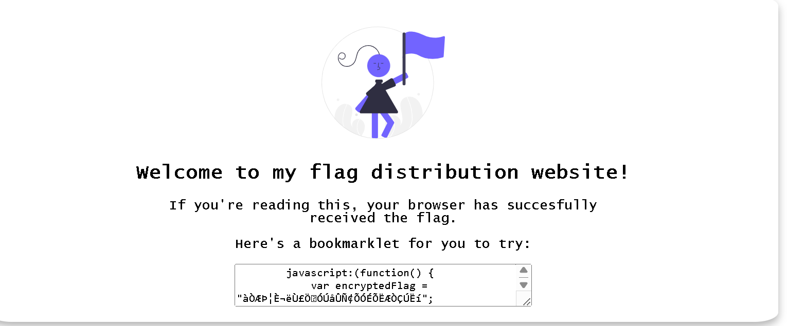

# Bookmarklet
- [Challenge information](#challenge-information)
- [Overview](#overview)
- [Solution](#solution)
- [Flag](#flag)
## Challenge information
```text
Tags: Web Explotation, picoCTF 2024, obfuscation, browser_webshell_solvable, browser

Description: Why search for the flag when I can make a bookmarklet to print it for me?

Hints: 
1. A bookmarklet is a bookmark that runs JavaScript instead of loading a webpage.
2. What happens when you click a bookmarklet?
3. Web browsers have other ways to run JavaScript too.
```
## Overview
  
### The web gives us a bookmarklet and it seems to ask us to decode it
## Solution
* The simplest way is to use the web console.  
* Right click select inspect , switch to console tab  
* Copy bookmarklet and paste it there to get the flag
## Flag
`picoCTF{p@g3_turn3r_cebccdfe}`