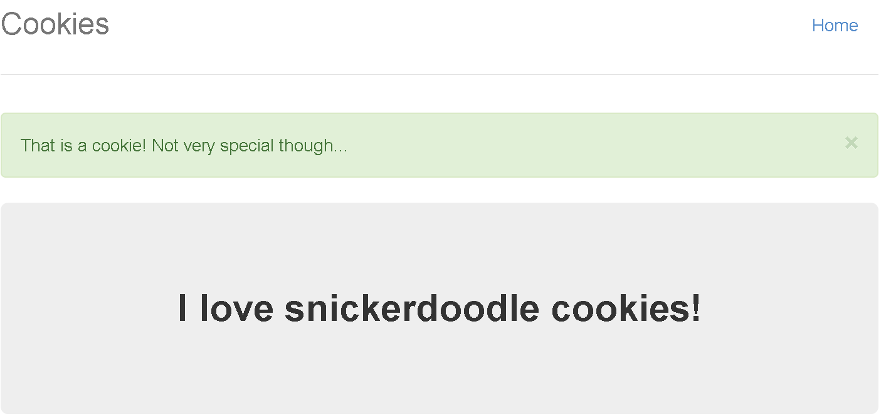
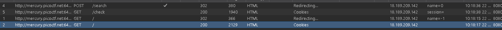
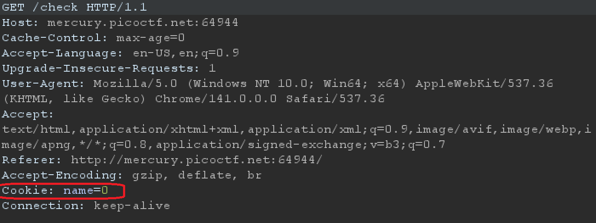
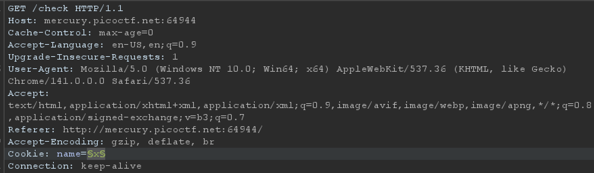

# Cookies
- [Challenge information](#challenge-information)
- [Overview](#overview)
- [Solution](#solution)
- [Flag](flag)
## Challenge information
```test
Tags: Web Explotation, picoCTF 2021

Description: Who doesn't love cookies? Try to figure out the best one.
http://mercury.picoctf.net:64944/

Hints: none
```
## Overview
  
The website allows us to enter cookies into a box (can be similar to a placeholder).  
  

## Solution
**Step1:** Use burpsuite to catch requests  
  
  
In request /check, you can see that the cookie is assigned a name parameter => mining point  

**Step2:** Exploit  
Use intruder to bruteforce the name parameter  
  
## Flag
`picoCTF{3v3ry1_l0v3s_c00k135_cc9110ba}`
