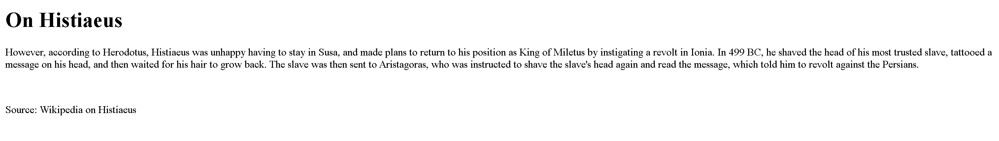

# Inspect HTML
- [Challenge information](#challenge-information)
- [Overview](#overview)
- [Solution](#solution)
- [Flag](#flag)
## Challenge information
```test
Tags: Web Explotation, picoCTF 2022, inspector

Description: Can you get the flag?

Hints: 
1. What is the web inspector in web browsers?
```
## Overview
  
* Web show gives us a piece of text
## Solution
`Ctr+U` to see source, flag is on the same day
## Flag
`picoCTF{1n5p3t0r_0f_h7ml_1fd8425b}`