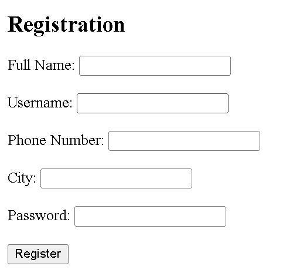
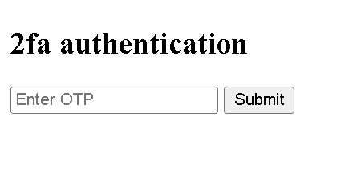
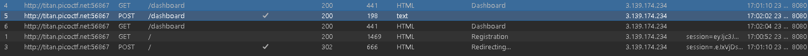
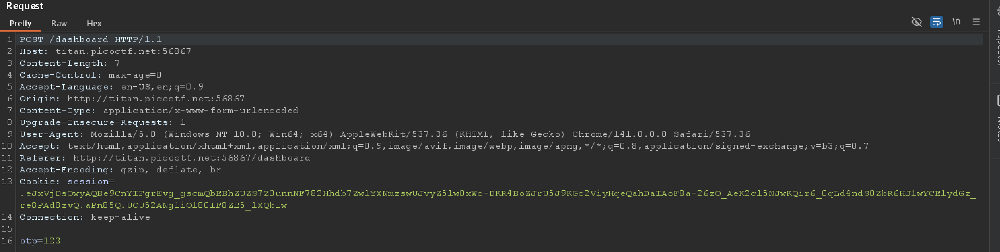

# Intro To Burp
- [Challenge information](#challenge-information)
- [Overview](#overview)
- [Solution](#solution)
- [Flag](#flag)
## Challenge information
```test
Tags: Web Explotation, picoCTF 2024

Description:  None

Hints: 
1. Try using burpsuite to intercept request to capture the flag.
2. Try mangling the request, maybe their server-side code doesn't handle malformed requests very well.
```
## Overview
* After accessing the web, the first thing we see is a login page.  

  
* After trying to enter some random things to fill the form, i got a request for an OTP code sent to hmm.. probably my phone number  


## Solution
**Step1:** Use burpsuite to capture requests  
  
**Step2:** Exploit  
* Turn on intercept on burpsuite, then send a random OTP code  

  
* If the website receives the OTP code for authentication, let's try deleting it and see how it goes (delete the entire line `otp=123`)  
=> Flag will be returned
## Flag
`picoCTF{#0TP_Bypvss_SuCc3$S_b3fa4f1a}`