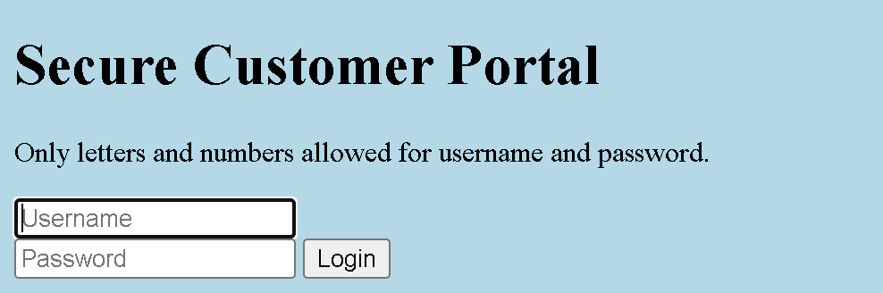

# Local Authority
- [Challenge information](#challenge-information)
- [Overview](#overview)
- [Solution](#solution)
- [Flag](#flag)
## Challenge information
```text
Tags: Web Explotation, picoCTF 2022, inspector

Description: Can you get the flag?

Hints: 
1. How is the password checked on this website?
```
## Overview
  
* A login page appears as soon as we access the web.  
* Only letters and numbers allowed for username and password.  
* I tried to log in with  
    * username : 123  
    * password : 123  

* Web returned `Log In Failed`
## Solution
**Step1:** Recon  
* After logging in with any username and password, `Ctr+U` to view source  
* We can see a js script written to handle the password filter part.  
```Javascript
function filter(string) {
        filterPassed = true;
        for (let i =0; i < string.length; i++){
          cc = string.charCodeAt(i);
          
          if ( (cc >= 48 && cc <= 57) ||
               (cc >= 65 && cc <= 90) ||
               (cc >= 97 && cc <= 122) )
          {
            filterPassed = true;     
          }
          else
          {
            return false;
          }
        }
        
        return true;
      }
    
      window.username = "123";
      window.password = "123";
      
      usernameFilterPassed = filter(window.username);
      passwordFilterPassed = filter(window.password);
      
      if ( usernameFilterPassed && passwordFilterPassed ) {
      
        loggedIn = checkPassword(window.username, window.password);
        
        if(loggedIn)
        {
          document.getElementById('msg').innerHTML = "Log In Successful";
          document.getElementById('adminFormHash').value = "2196812e91c29df34f5e217cfd639881";
          document.getElementById('hiddenAdminForm').submit();
        }
        else
        {
          document.getElementById('msg').innerHTML = "Log In Failed";
        }
      }
      else {
        document.getElementById('msg').innerHTML = "Illegal character in username or password."
      }
```
* loggedIn receives the result returned from the checkPassword function  
 ```Javascript
 loggedIn = checkPassword(window.username, window.password);
 ```
* In the source there is also a section that tells us the code `secure.js`
```html
<script src="secure.js"></script>
```  
* If you test it, you can immediately see the checkpassword function we are looking for.
```Javascript
function checkPassword(username, password)
{
  if( username === 'admin' && password === 'strongPassword098765' )
  {
    return true;
  }
  else
  {
    return false;
  }
}
```
**Step2** : Exploit  
Login with:  
* Username = admin  
* Password = strongPassword098765  
  
Flag will be returned
## Flag
`picoCTF{j5_15_7r4n5p4r3n7_a8788e61}`