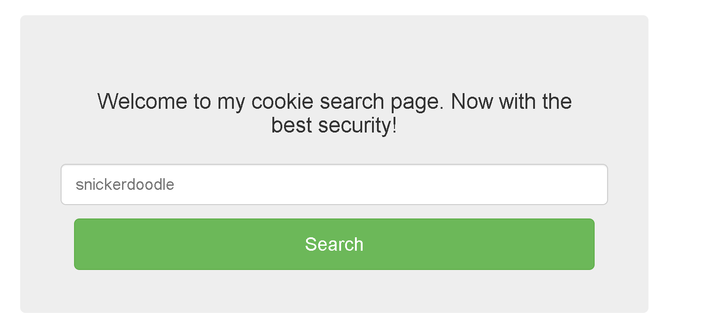

# Most Cookies
- [Challenge information](#challenge-information)
- [Overview](#overview)
- [Solution](#solution)
- [Flag](#flag)
## Challenge information
```text
Tags: picoCTF 2021, Web Exploitation

Description: Alright, enough of using my own encryption. Flask session cookies should be plenty secure!

server.py
http://mercury.picoctf.net:6259/

Hints:
1. How secure is a flask cookie?
```
## Overview
Same as previous posts, 1 page allows us to enter cookies and the purpose is still to find admin cookies  

## Solution
**Step1:** Recon  
* Let's start by analysing the server source code [server.py](./Static/Code/Cookies/Most_Cookies/Most_Cookies.py)  
* We can see that the secret key is chosen randomly from one of the cookie names
```python
cookie_names = ["snickerdoodle", "chocolate chip", "oatmeal raisin", "gingersnap", "shortbread", "peanut butter", "whoopie pie", "sugar", "molasses", "kiss", "biscotti", "butter", "spritz", "snowball", "drop", "thumbprint", "pinwheel", "wafer", "macaroon", "fortune", "crinkle", "icebox", "gingerbread", "tassie", "lebkuchen", "macaron", "black and white", "white chocolate macadamia"]
app.secret_key = random.choice(cookie_names)
```  
* And we want the `very_auth` value to be set to `admin` to get the flag
```python
		check = session["very_auth"]
		if check == "admin":
			resp = make_response(render_template("flag.html", value=flag_value, title=title))
			return resp
```  
=> In short, our task now is to find the correct cookie, then encrypt the flask and send it as a session cookie.  
  
**Step2:** Exploit  
Use code [here](./Static/Code/Cookies/Most_Cookies/Solution.py)
* I encoded a cookie chosen from 1 of the 28 cookie challenge provided  
* then send it as a session cookie  
## Flag
`picoCTF{pwn_4ll_th3_cook1E5_5f016958}`
