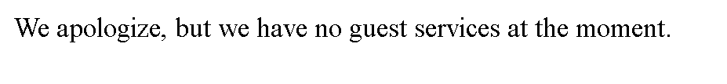

# Power Cookie
- [Challenge information](#challenge-information)
- [Overview](#overview)
- [Solution](#solution)
- [Flag](#flag)
## Challenge information
```test
Tags: Web Explotation, picoCTF 2022, cookie

Description: Can you get the flag? -_- 

Hints: 
1. Do you know how to modify cookies?
```
## Overview
A website with nothing special  
  
  
We can continue as guest  
  
And we are blocked :)  
## Solution
**Step1:** Recon  
* Right-click on the web, select inspect, then go to application (On google)  
* In the Cookies section, we can see something quite interesting  
`isAdmin=0`  
**Step2:** Exploit  
Change is to get the flag  
`isAdmin=1`  
## Flag
`picoCTF{gr4d3_A_c00k13_65fd1e1a}`