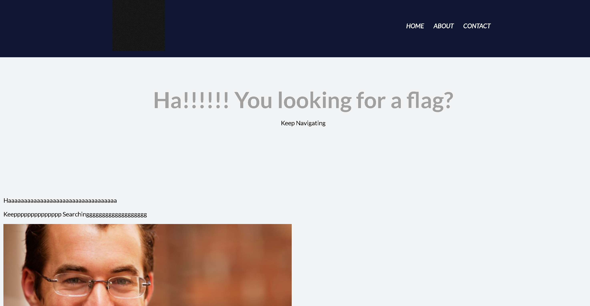
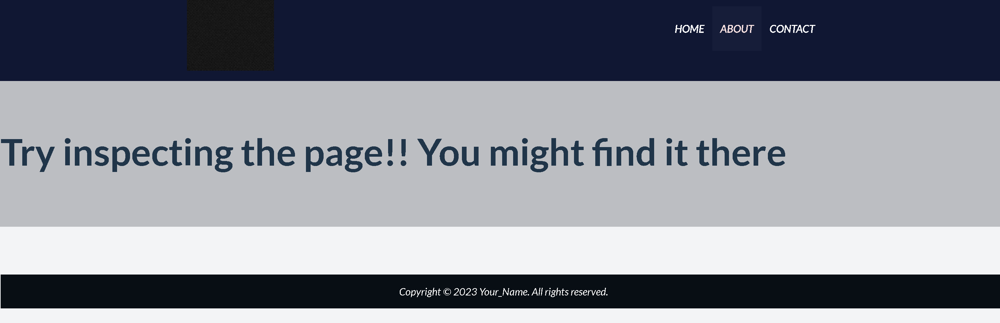

# Web Decode
- [Challenge information](#challenge-information)
- [Overview](#overview)
- [Solution](#solution)
- [Flag](#flag)
## Challenge information
```test
Tags: Web Explotation, picoCTF 2024, browser_webshell_solvable

Description:  Do you know how to use the web inspector?

Hints: 
1. Use the web inspector on other files included by the web page.
2. The flag may or may not be encoded
```
## Overview
### A strange website  
  
  

## Solution
**Step1:** Recon  
* notice in the picture at /about , it seems the web is trying to give us a hint  
* right click to see inspector  
* I found a strange line of code, the notify_true part is put into a base64 encoded string  
` <section class="about" notify_true="cGljb0NURnt3ZWJfc3VjYzNzc2Z1bGx5X2QzYzBkZWRfMjgzZTYyZmV9">`
**Step2:** Exploit  
Decode string to get flag
## Flag
`picoCTF{web_succ3ssfully_d3c0ded_283e62fe}`